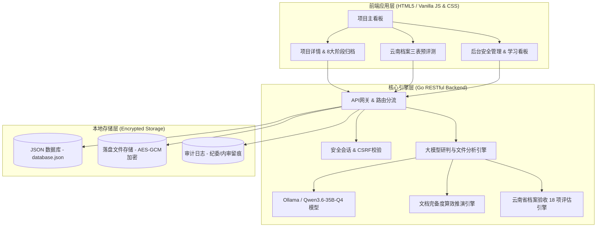

# 政务智管・信息化项目全生命周期智能管控平台

## 一、项目定位与核心价值

**政务智管** 是一款专为地市/区县政府单位信息中心设计的信息化项目生命周期智能管理系统。系统面向项目管理员、分管领导、项目负责人、监理单位和财务对接人，提供轻量化、智能化的管控方案。

### 1. 核心解决痛点
- **资料流失与归档繁琐**：传统的项目可研、招标、合同、监理周报、协调会议纪要散落在各处，难以统一审计。本平台支持按项目阶段自动创建文件夹并提供零表单的文档自动归档。
- **关键时间节点容易遗漏**：付款、初验、终验、质保期到期等重要时限仅凭人工记忆，违约或逾期风险较高。平台通过自动解析文件提取节点，分三级实施主动预警。
- **项目风险后知后觉**：变更违规、进度严重滞后、预算超支等问题缺乏自动识别工具。本平台通过大模型深度研判，在后台实时出具健康度评估。
- **公文与汇报撰写负担重**：手动整理项目台账和工作汇报材料耗时费力。大模型一键生成周报简报、整改通知及自查报告。
- **云南省重点项目档案验收填报复杂**：依据《云南省重点建设项目档案验收实施办法》，自动读取落盘归档文件正文并开展 18 项指标真实打分，自动填报持久化“附件1、2、3”验收表格。

---

## 二、系统架构设计

本平台采用极简的涉密内网适配三层架构体系：



1. **底层存储层**：基于本地 JSON 结构化数据库与 AES-GCM 文件防篡改加密存储。内置符合等保 2.0 规范的**操作审计日志**，确保所有文件上传、下载、修改行为全程留痕，满足纪检与财政审计要求。
2. **核心引擎层**：Go 高性能后端路由与大模型接口对接，提供：
   - **文件解析**：自动解析可研/合同，提取工期、付款条款与验收标准。
   - **智能研判**：实时比对文档条款，交叉检查进度偏差、资金缺口和无审批变更。
   - **云南档案评测**：真实读取文档正文，填报云南省档案验收“附件1自查表、附件2申请表、附件3评分表”并按项目持久化存盘。
   - **阶段算效推演**：根据项目归档资料在 8 大大类目录中的完备度，自动推演并实时更新项目生命周期阶段。
   - **公文生成**：一键套用政务格式生成周报简报，并支持导出 Word (.doc) 文档。
3. **前端应用层**：极简响应式 Web 控制台，无复杂多级菜单，突出健康评分与预警卡片，完美适配中年政务管理人员操作习惯。

---

## 三、功能模块结构

平台设计有七大核心业务模块：

1. **前台一站式项目新建与档案建立 (`+ 新建项目建档`)**：
   前台首页直接提供沉浸式建档弹窗，支持录入项目名称、立项文号、项目负责人、预算、初始生命阶段、开始与完工日期、承建集成商及建设内容，提交后自动触发大模型后台研判与学习。
2. **项目全生命周期文件归档（智能分类与展开/折叠）**：
   按照**立项、招标、合同、实施、监理、过程资料、验收、质保运维**八个标准阶段自动归档。归档目录标题支持点击展开/折叠（默认折叠），支持跨文件全文检索、内容摘要提取，以及多版本变更文件差异对比。
3. **云南省重点建设项目档案验收预评测（附件1、2、3自动化与持久化）**：
   不仅看文档是否存在，更**真实读取磁盘文档正文文本**，针对《云南省重点建设项目档案验收实施办法》18 项具体指标进行逐项比对评测。自动填报并按项目持久化保存**附件1自查表、附件2申请表、附件3评分表**，支持重新评测、前台实时展开预览与打印导出。
4. **项目阶段“自动算效推演”与“手工下拉切换”双模机制**：
   - **默认自动算效推演**：系统根据归档文件的完备度自动将项目生命周期推进至最新阶段。
   - **手工下拉指定**：前台详情页标题旁提供交互式下拉框，支持在 `🔄 自动 (根据文档完备度推演)` 与 8 大阶段（立项/设计/实施/监理/设备/财务/验收/运维）之间随意切换与人工指定。
5. **前台一键生成本周项目简报公文与 Word 导出**：
   点击 `📢 一键生成本周项目简报` 瞬间弹出全屏高透毛玻璃 Modal 预览窗口，汇总全平台在办项目运行态势与受阻项目，并提供 `📥 导出 Word (.doc) 简报` 按钮，一键下载标准 Word 格式文件。
6. **节点预警与消息推送**：
   根据大模型抓取的付款与合同交付节点进行倒计时。提供**蓝色（提前7天温馨提醒）、黄色（当日到期紧急提醒）、红色（已逾期风险预警）**三级机制，并支持企业微信/政务微信模板消息同步发送。
7. **后台学习进度看板与综合完成率**：
   智能学习看板定时自动对未评测的项目进行预评测并保存持久化结果。全局综合学习状态第 4 阶段升级为 **`⚖️ 4. 项目评测`**，精准展现全站项目的评测覆盖率（如 `11 / 11 项目 100.00%`）。

---

## 四、技术栈说明

- **后端开发**：Go (Golang 1.18+ / 1.22.5 兼容)
  - 标准库 `net/http` 实现极简、低消耗的路由分流器。
  - 基于读写互斥锁 (`sync.RWMutex`) 保障高并发下 JSON 文件数据库的数据一致性。
- **前端开发**：Vanilla HTML5 + 原生 CSS3 + Vanilla JavaScript (ES6)
  - 弃用臃肿的第三方框架，页面轻量，首屏加载在毫秒级完成，完美满足涉密政务网终端环境的兼容要求。
  - 顶部指标卡片点击具有经典深政务蓝 (`#0f2b5c`) 与纯白文字的高亮选中效果。
  - 基于会话 Cookie (`SessionToken`) 与跨站防御 (`X-CSRF-Token`) 的统一安全封装请求器 `apiFetch`。
- **数据库**：轻量级本地 JSON 数据库 (`data/database.json`)，避免了外部大型数据库的部署成本与数据安全隐患，迁移备份极其简单。
- **接入大模型**：`qwen3.6:35b-q4`（通义千问 Qwen3.6 35B 4-bit 量化大模型，集成 12s 防挂起超时及备用文本模版降级引擎）。

---

## 五、项目目录结构

```text
ProjectManager/
├── backend/                  # 后端 Go 业务实现
│   ├── db.go                 # 数据库驱动与读写互斥控制
│   ├── handlers.go           # RESTful 接口控制器 (包含简报生成、新建项目、阶段推演等)
│   ├── models.go             # 核心结构体定义 (项目、云南评测三表、用户、日志、预警)
│   ├── security.go           # 密码哈希、落盘文件 AES-GCM 加密
│   ├── pipeline.go           # 后台大模型学习与离线评测引擎
│   └── llm.go                # 大模型智能接口、云南档案 18 项比对打分引擎
├── frontend/                 # 前端静态 Web 页面
│   ├── index.html            # 首页台账主看板 (含简报弹窗、新建项目弹窗)
│   ├── detail.html           # 项目全周期详情、云南档案评测三表与下拉阶段页
│   ├── admin.html            # 后台控制面板 & 学习进度看板
│   ├── css/                  # 样式表 (main.css / admin.css)
│   └── js/                   # 前端 JS 逻辑模块
│       ├── utils.js          # API 请求封装 (apiFetch) 与通用辅助函数
│       ├── auth.js           # 身份校验与会话管理
│       ├── ledger.js         # 看板台账动态加载、简报弹窗与新建项目处理
│       ├── detail.js         # 详情页智能提取、云南预评测渲染与阶段下拉
│       └── admin.js          # 后台用户配置、学习进度看板与 CSV 导出
├── data/                     # 生产环境数据存放目录 (自动生成)
│   ├── database.json         # 结构化主数据 JSON (持久化云南评测附件1、2、3)
│   ├── file_key.bin          # 资料 AES 加密所需的 256 位密钥
│   └── uploads/              # AES-GCM 加密存储的项目归档文件
├── main.go                   # 主入口程序 (启动 HTTP 服务与端口监听)
└── server                    # 编译后的服务器可执行二进制文件
```

---

## 六、部署与运行指南

### 1. 环境准备
- 安装 **Go (1.18 或更高版本，推荐 Go 1.22+)** 编译后端。
- 系统运行无需安装外部数据库，系统启动时将自动在本地初始化 `data/` 目录和示例数据。

### 2. 编译与启动
在项目根目录下，执行以下命令进行编译和运行：

```bash
# 编译 Go 后端程序
go build -o server main.go

# 启动服务 (默认监听在本地 http://127.0.0.1:81)
./server
```

### 3. 系统登录凭证
预装了以下四级权限的演示账号（密码均为 `admin123`）：

| 账号 | 姓名 | 角色 | 权限说明 |
| :--- | :--- | :--- | :--- |
| `admin` | 张主任 | `super_admin` | **超级管理员**，可访问后台控制面板所有功能，具备重置密码、修改安全参数及审计导出权限。 |
| `manager` | 李科长 | `project_admin` | **项目管理员**，负责项目的新增、修改阶段以及查看全局项目信息。 |
| `owner` | 小王 | `project_owner` | **项目负责人**，仅有权访问自己负责的项目资料与对话研判，用于一线执行层。 |
| `leader` | 赵局长 | `reader` | **只读领导**，只读访问主台账与系统监控统计，无法增删改项目。 |

---

## 七、近期重大升级与特色功能

1. **云南省重点建设项目档案验收预评测（附件1、2、3全自动持久化）**
   - 彻底打通云南省档案验收 18 项指标正文真读取与打分核算，自动填报并按项目持久化存盘附件 1、2、3。前台支持随时查看折叠/展开、重新测评与下载导出。
2. **项目阶段“自动算效推演”与“手工下拉切换”**
   - 默认根据文件在 8 大国家标准大类中的归档完备度实时推演项目生命阶段。在详情页标题旁配有下拉选择框，支持选择 `🔄 自动` 或手动指定 `立项`~`运维` 阶段。
3. **前台一站式新建项目建档 (`+ 新建项目建档`)**
   - 前台首页直接提供规范的项目建档 Modal 弹窗，支持全量字段录入，提交后自动分配 ID 并触发后台大模型研判学习。
4. **一键生成本周项目简报与 Word (.doc) 导出**
   - 首页 `📢 一键生成本周项目简报` 点击后弹窗显示全平台运营简报，并支持一键下载标准 Word 格式公文文件。
5. **顶部 4 大分类指标卡片交互高亮**
   - 点击 `在办项目总数`、`处于验收阶段`、`代付款期数`、`存在合规预警` 指标卡片，卡片瞬间切换为深政务蓝 (`#0f2b5c`) 背景与纯白文字，视觉选中感突出。
6. **自动化集成测试 100% 通过**
   - 全站静态资源与 20 个核心 RESTful API 接口经全量自动化测试，通过率 100%。
