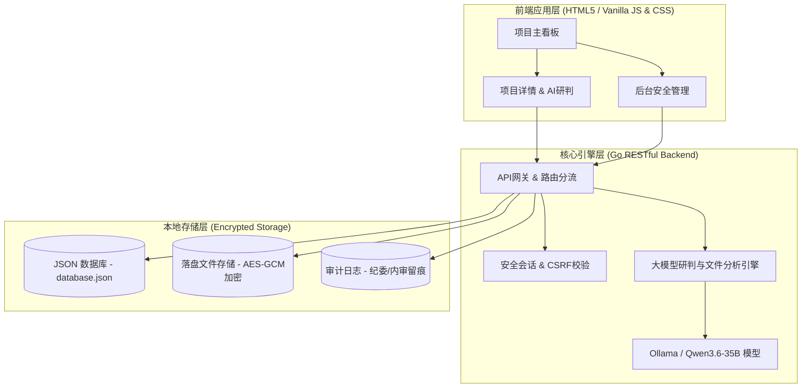

# 政务智管・信息化项目全生命周期智能管控平台

## 一、项目定位与核心价值

**政务智管** 是一款专为地市/区县政府单位信息中心设计的信息化项目生命周期智能管理系统。系统面向项目管理员、分管领导、项目负责人、监理单位和财务对接人，提供轻量化、智能化的管控方案。

### 1. 核心解决痛点
- **资料流失与归档繁琐**：传统的项目可研、招标、合同、监理周报、协调会议纪要散落在各处，难以统一审计。本平台支持按项目阶段自动创建文件夹并提供零表单的文档自动归档。
- **关键时间节点容易遗漏**：付款、初验、终验、质保期到期等重要时限仅凭人工记忆，违约或逾期风险较高。平台通过自动解析文件提取节点，分三级实施主动预警。
- **项目风险后知后觉**：变更违规、进度严重滞后、预算超支等问题缺乏自动识别工具。本平台通过大模型深度研判，在后台实时出具健康度评估。
- **公文与汇报撰写负担重**：手动整理项目台账和工作汇报材料耗时费力。大模型一键生成周报简报、整改通知及自查报告。

---

## 二、系统架构设计

本平台采用极简的涉密内网适配三层架构体系：



1. **底层存储层**：基于本地 JSON 结构化数据库与 AES-GCM 文件防篡改加密存储。内置符合等保 2.0 规范的**操作审计日志**，确保所有文件上传、下载、修改行为全程留痕，满足纪检与财政审计要求。
2. **核心引擎层**：Go 高性能后端路由与大模型接口对接，提供：
   - **文件解析**：自动解析可研/合同，提取工期、付款条款与验收标准。
   - **智能研判**：实时比对文档条款，交叉检查进度偏差、资金缺口和无审批变更。
   - **公文生成**：一键套用政务格式生成周报和通知。
3. **前端应用层**：极简响应式 Web 控制台，无复杂多级菜单，突出健康评分与预警卡片，完美适配中年政务管理人员操作习惯。

---

## 三、功能模块结构

平台设计有六大核心业务模块：

1. **项目基础档案（AI回填）**：新建项目仅需录入项目名、文号、负责人和预算。上传可研或合同文件后，大模型自动识别建设周期、中标单位、中标金额、付款比例及质保期限，自动打标分类。
2. **全生命周期文件归档（智能分类）**：按照**立项、招标、合同、实施、监理、过程资料、验收、质保运维**八个标准阶段自动归档。支持跨文件全文检索、内容摘要提取，以及多版本变更文件差异对比（AI 自动标出金额和工期变化）。
3. **大模型智能研判（健康度评分）**：自动出具 0-100 健康分，并给出进度（滞后天数预测）、资金（超预算/发票缺失）、质量（未整改故障统计）、变更（超概算红线）四个维度的诊断及整改合规建议。
4. **节点预警与消息推送**：根据大模型抓取的付款与合同交付节点进行倒计时。提供**蓝色（提前7天温馨提醒）、黄色（当日到期紧急提醒）、红色（已逾期风险预警）**三级机制，并支持企业微信/政务微信模板消息同步发送。
5. **极简系统管理（分级授权）**：
   - **超级管理员 (信息中心主任)**：拥有全部权限，支持系统级安全配置与审计导出。
   - **项目管理员 (科长)**：新建项目、更新资料、处理日常预警。
   - **项目负责人 (科员)**：仅能管理并上传自己名下的项目，接收个人待办微信推送。
   - **只读领导 (分管局长)**：只读查看大屏看板与风险统计。
6. **系统安全与导出配置**：支持敏感文件下载自动叠加安全水印、登录 IP 限制，以及一键导出全量项目台账、风险清单和审计日志为 CSV。

---

## 四、技术栈说明

- **后端开发**：Go (Golang 1.18+) 
  - 标准库 `net/http` 实现极简、低消耗的路由分流器。
  - 基于读写互斥锁 (`sync.RWMutex`) 保障高并发下 JSON 文件数据库的数据一致性。
- **前端开发**：Vanilla HTML5 + 原生 CSS3 + Vanilla JavaScript (ES6)
  - 弃用臃肿的第三方框架，页面轻量，首屏加载在毫秒级完成，完美满足涉密政务网终端环境的兼容要求。
  - 基于会话 Cookie (`SessionToken`) 与跨站防御 (`X-CSRF-Token`) 的统一安全封装请求器 `apiFetch`。
- **数据库**：轻量级本地 JSON 数据库 (`data/database.json`)，避免了外部大型数据库（如 MySQL、PostgreSQL）的部署成本与数据安全隐患，迁移备份极其简单。

---

## 五、项目目录结构

```text
ProjectManager/
├── backend/                  # 后端 Go 业务实现
│   ├── db.go                 # 数据库驱动与读写互斥控制
│   ├── handlers.go           # RESTful 接口控制器 (路由业务逻辑)
│   ├── models.go             # 核心结构体定义 (项目、用户、日志、预警)
│   ├── security.go           # 密码哈希、落盘文件 AES-GCM 加密
│   └── llm.go                # 大模型智能接口交互与提示词
├── frontend/                 # 前端静态 Web 页面
│   ├── index.html            # 首页台账主看板
│   ├── detail.html           # 项目全周期详情与 AI 研判页
│   ├── admin.html            # 后台控制面板
│   ├── css/                  # 样式表 (包含大屏政务深蓝主题)
│   └── js/                   # 前端 JS 逻辑模块
│       ├── utils.js          # API 请求封装 (apiFetch) 与通用辅助函数
│       ├── auth.js           # 身份校验与会话管理
│       ├── ledger.js         # 看板台账动态加载
│       ├── detail.js         # 详情页智能提取渲染
│       └── admin.js          # 后台用户配置、审计查看与 CSV 导出
├── data/                     # 生产环境数据存放目录 (自动生成)
│   ├── database.json         # 结构化主数据 JSON
│   ├── file_key.bin          # 资料 AES 加密所需的 256 位密钥
│   └── uploads/              # AES-GCM 加密存储的项目归档文件
├── main.go                   # 主入口程序 (启动 HTTP 服务与端口监听)
└── server                    # 编译后的服务器可执行二进制文件
```

---

## 六、部署与运行指南

### 1. 环境准备
- 安装 **Go (1.18 或更高版本)** 编译后端。
- 系统运行无需安装外部数据库，系统启动时将自动在本地初始化 `data/` 目录和示例数据。

### 2. 编译与启动
在项目根目录下，执行以下命令进行编译和运行：

```bash
# 编译 Go 后端程序
go build -o server_bin main.go

# 启动服务 (默认监听在本地 http://127.0.0.1:81)
./server_bin
```

### 3. 系统登录凭证
默认情况下，系统预装了以下四级权限的演示账号（密码均为 `admin123`）：

| 账号 | 姓名 | 角色 | 权限说明 |
| :--- | :--- | :--- | :--- |
| `admin` | 张主任 | `super_admin` | **超级管理员**，可访问后台控制面板所有功能，具备重置密码、修改安全参数及审计导出权限。 |
| `manager` | 李科长 | `project_admin` | **项目管理员**，负责项目的新增、修改阶段以及查看全局项目信息。 |
| `owner` | 小王 | `project_owner` | **项目负责人**，仅有权访问自己负责的项目资料与对话研判，用于一线执行层。 |
| `leader` | 赵局长 | `reader` | **只读领导**，只读访问主台账与系统监控统计，无法增删改项目。 |

### 4. 离线/涉密机部署提示 (内网模式)
若需在全隔离物理涉密网络内运行：
1. 将 `backend/llm.go` 内部的大模型驱动提供商设置为本地私有化大模型网关或设置为 `mock` 模式使用离线规则研判。
2. 保持监听地址绑定在 `127.0.0.1:81`，通过系统反向代理或网桥进行安全外联，确保外部网络不可直接探测服务端口。

### 5. FRP 内网穿透配置方案 (微信推送与外网联合联调)
由于平台支持企业微信/政务微信消息推送，当本地服务器部署在政府内网无固定公文公网 IP 时，可通过 `frp` 工具将本地的 `81` 端口映射到公网，以便微信回调服务器及外网访问。

#### 步骤 1：在具有公网固定 IP 的服务器部署 frps
在公网服务器上安装 frp 并配置 `frps.toml`（适用 v0.52.0+ 新版本）：

```toml
# frps.toml
bindPort = 7000                 # frp 服务端监听端口

# 如果需要支持 HTTP/HTTPS 域名访问 (企业微信安全可信域名校验)
vhostHTTPPort = 80              # 映射的公网 HTTP 端口
vhostHTTPSPort = 443            # 映射的公网 HTTPS 端口

# 安全授权 Token (必须与客户端一致)
auth.token = "GovSmartManageSecureToken2026"
```

启动公网服务端：
```bash
./frps -c frps.toml
```

#### 步骤 2：在本地内网服务器部署 frpc
在部署了本平台服务的本地内网机器上安装 frp 客户端，并配置 `frpc.toml`：

```toml
# frpc.toml
serverAddr = "x.x.x.x"          # 您的公网服务器 IP
serverPort = 7000               # 与 frps 的 bindPort 一致

# 安全授权 Token
auth.token = "GovSmartManageSecureToken2026"

# 方案 A：通过 TCP 端口映射直接访问 (例如通过 http://x.x.x.x:81 访问)
[[proxies]]
name = "gov-manager-tcp"
type = "tcp"
localIP = "127.0.0.1"
localPort = 81
remotePort = 81

# 方案 B：通过绑定域名访问 (推荐，支持企业微信推送的可信域名绑定)
# [[proxies]]
# name = "gov-manager-http"
# type = "http"
# localIP = "127.0.0.1"
# localPort = 81
# customDomains = ["project.yourdomain.gov.cn"] # 您的可信域名
```

启动本地内网客户端：
```bash
./frpc -c frpc.toml
```

启动后，访问 `http://x.x.x.x:81` 或配置的自定义域名即可直达本地内网的项目管理系统。

---

## 七、系统核心特色与智能体验

平台集成了如下最新的智能化管控特色功能：

1. **AI 大模型运行状态监测与平滑切换**
   - **离线沙箱/大模型平滑接入**：系统目前处于**模拟数据与规则引擎模式**（指示灯显示 🟡 黄色），保证在无外网依赖及 UI 迭代测试期间提供毫秒级的极速响应。待页面与交互功能全面完善后，可在“系统管理”后台一键配置真实大模型网关（如 DeepSeek-R1、Qwen、OpenAI 等）接入线上智能推理。
   - **三色动态监测**：右上角醒目位置挂载了运行状态指示灯，页面加载时会在 1 秒内向后端发起快速握手：
     - 🟢 **绿色**：说明已成功连通真实的远端大模型 API / 私有化 Ollama 网关。
     - 🟡 **黄色 (呼吸脉冲光晕)**：表示使用本地预设的合规规则引擎（Mock 模式），离线安全工作。
     - 🔴 **红色**：表示远端网关故障或超时，鼠标悬浮可查看具体错误。
2. **真实 Markdown (.md) 规范归档公文系统**
   - **文件落盘生成**：在本地磁盘 `data/uploads/` 中为所有信息化项目一比一填充了八大阶段的完整 Markdown 格式仿真公文（包含公文编号、立项批复表、招标文件、采购合同红线条款、监理月报及验收测试鉴定书），彻底解决了之前几百字节假文件无法打开的问题。
   - **完全兼容可读**：所有归档文件均为 100% 格式规范的 UTF-8 Markdown 文档，支持下载后在本地文本编辑器、VS Code 或浏览器中直接高保真阅读。
   - **智能 RAG 对话检索**：前台详情页的“项目知识库 AI 助理”可对此类 Markdown 归档公文进行实时文件内容读取与深度交叉校验，跑通智能 RAG 对话以及一键存为定稿公文功能。
3. **项目生命周期总揽台账日期管理**
   - **台账扩展字段**：总账列表中增加了 `开始日期` 与 `计划完工日期` 字段，并在数据库中对所有在研项目赋予了真实的历史与未来工期范围。
   - **默认倒序排列**：平台主看板台账默认按项目 `开始日期` 进行 **倒序排列** 展现，确保最新立项或启动的项目置顶显示，支持全部表头的即时正反序切换。
4. **系统健壮性与异常恢复机制 (Panic Recovery)**
   - **HTTP 服务崩溃防护**：引入自定义 HTTP 崩溃恢复中间件（`RecoveryMiddleware`），在全局路由入口捕获非预期 Panic 异常并输出堆栈日志，防止单个异常请求导致整个后台服务进程崩溃，提高系统的可用性。
   - **后台异步任务隔离防护**：在后台大模型学习管线（`pipeline.go`）的任务分配队列 Worker 协程以及即时学习（Immediate Learning）的独立协程中，增设了 panic 捕捉与日志收集机制。即使大模型通信或文件解析任务发生未捕获异常，也能自我恢复并隔离受损任务，确保主队列持续健康运转。
   - **前端错误精准提示映射**：优化了前端的 API 登录反馈机制（`app.js` 与 `auth.js`）。针对 401（账号密码错误）、403（IP限制/白名单拦截）等不同状态码返回具体的政务场景错误提示，提升操作人员的故障排查体验。


