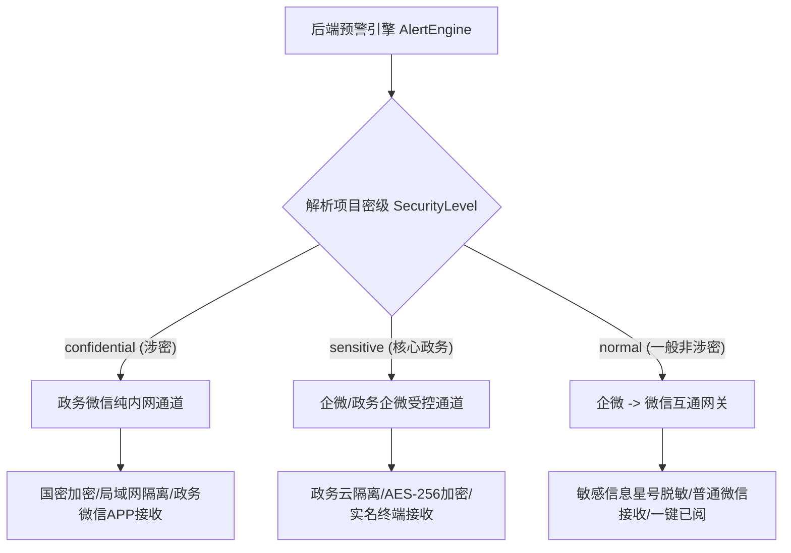

# 政府信息中心大模型智能信息化项目管理系统 - 微信推送功能开发实施计划

综合 [需求.txt](file:///root/www/ProjectManager/docs/%E9%9C%80%E6%B1%82.txt)、[企业微信配置实施.md](file:///root/www/ProjectManager/docs/%E4%BC%81%E4%B8%9A%E5%BE%AE%E4%BF%A1%E9%85%8D%E7%BD%AE%E5%AE%9E%E6%96%BD.md) 以及 [微信推送.md](file:///root/www/ProjectManager/docs/%E5%BE%AE%E4%BF%A1%E6%8E%A8%E9%80%81.md) 的设计设计要求，特制定本**微信推送功能开发计划**。

---

## 一、 开发目标与总体要求

1. **功能目标**：实现信息化项目节点到期（预付款/进度款/验收/质保）倒计时自动预警、大模型风险研判（滞后/超概/违规变更/质量隐患）实时推送、微信卡片“已阅”回执以及 30 天微信端历史记录留存。
2. **体验目标**：无需安装第三方 APP，无需申请微信公众号，普通公职人员直接在**日常微信**中接收预警并点击交互。
3. **安全目标**：严格落地“分级分类管控”——涉密项目走政务微信内网隔离通道，一般项目走企微/微信互通脱敏通道，符合等保 2.0 及保密审计审查。

---

## 二、 系统架构与分级路由设计



---

## 三、 详细阶段划分与任务拆解 (进度安排：共 7 天)

### 阶段 1：账号环境配置与凭证准备（第 1 天）
- [ ] **任务 1.1**：登录企业微信/政务微信后台，创建自建应用 `政务智管预警助手`。
- [ ] **任务 1.2**：获取并安全保存 `CorpID`、`AgentID`、`Secret` 核心凭证。
- [ ] **任务 1.3**：配置【微信插件】，生成邀请二维码，完成测试人员的普通微信关注关联。
- [ ] **任务 1.4**：创建项目组微信互通群，配置群机器人 Webhook 地址。

### 阶段 2：Go 后端基础通信模块与安全脱敏层开发（第 2 ~ 3 天）
- [ ] **任务 2.1**：在 [backend/security.go](file:///root/www/ProjectManager/backend/security.go) 中扩展 `SafeHTTPClient`，实现企业微信 API 高可用 HTTP 客户端。
- [ ] **任务 2.2**：编写 `GetWeChatAccessToken` 模块，实现 `access_token` 的自动获取、内存缓存与到期前刷新机制。
- [ ] **任务 2.3**：编写 `SendWeChatTemplateCard` 模块，封装文本卡片、图文卡片消息格式。
- [ ] **任务 2.4**：编写 `DesensitizeText` 敏感字段脱敏算法（对涉及预算金额、涉密文号进行星号遮罩）。
- [ ] **任务 2.5**：编写 `PushAlertRouting` 路由调度函数，根据项目密级与预警级别分流至不同通道。

### 阶段 3：预警触发引擎与大模型研判集成（第 4 ~ 5 天）
- [ ] **任务 3.1**：**固定节点定时预警**——编写每日定时任务，扫描项目合同付款日、初验截止日、质保到期日，匹配“提前 7 天（蓝色）、当日（黄色）、已逾期（红色）”触发推送。
- [ ] **任务 3.2**：**AI 风险实时预警**——在 [backend/pipeline.go](file:///root/www/ProjectManager/backend/pipeline.go) 资料解析流中埋点，当大模型研判出严重滞后、违规变更、超概算时，实时触发红色预警推送。
- [ ] **任务 3.3**：**角色精准路由**——匹配 `super_admin`（收全量高风险）、`project_owner`（收本项目）、`reader`/财务（收专项节点）的接收人微信号 `WechatID`。

### 阶段 4：前端卡片交互与“已阅”回执模块（第 6 天）
- [ ] **任务 4.1**：编写 `/api/alerts/ack` 微信已阅回执接口，支持微信端卡片按钮直接触发回执。
- [ ] **任务 4.2**：前端 Web 管理后台管理面板 [frontend/admin.html](file:///root/www/ProjectManager/frontend/admin.html) 中展示微信已阅状态与阅读时间。
- [ ] **任务 4.3**：微信端 30 天历史预警查询面板适配，提供免登录历史消息翻看功能。

### 阶段 5：分级连通性测试、演练与审计验证（第 7 天）
- [ ] **任务 5.1**：在后台【大模型/消息设置】添加“微信网关连通性测试”按钮，验证握手时延与状态。
- [ ] **任务 5.2**：模拟“涉密项目”、“核心政务项目”与“一般项目”，验证消息投递路由与脱敏效果。
- [ ] **任务 5.3**：核查 [backend/security.go](file:///root/www/ProjectManager/backend/security.go) 中的操作审计日志，确保微信推送记录全程留痕。

---

## 四、 核心 API 与接口设计说明

### 1. 微信预警推送统一路由 API
- **内部函数**：`PushAlertRouting(project *Project, alert *AlertInfo) error`
- **处理逻辑**：
  ```go
  if project.IsConfidential {
      // 涉密项目：仅发政务微信内网私有通道
      return sendGovWeChatInternal(project, alert)
  }
  if alert.Level == "red" {
      // 严重风险：发分管领导与管理员（完整分析卡片）
      return sendEnterpriseWeChatCard(project, alert, getLeadersAndOwners(project))
  }
  // 常规节点：脱敏后发负责人普通微信
  return sendWeChatPublicNotice(project, desensitizeAlert(alert), project.OwnerWeChatID)
  ```

### 2. 微信已阅回执 API
- **接口路径**：`POST /api/alerts/ack`
- **请求参数**：
  ```json
  {
      "alert_id": "alt_20260728_001",
      "wechat_id": "wx_owner_wang",
      "ack_time": "2026-07-28 16:00:00"
  }
  ```
- **响应参数**：`{"status": "success", "message": "已成功记录预警阅读回执"}`

---

## 五、 风险控制与验收交付标准

| 风险项 | 风险等级 | 应对策略与控制措施 |
| :--- | :--- | :--- |
| **`access_token` 频繁刷新导致限流** | 中 | 使用单例模式与 Redis/内存缓存，在 7000 秒时单线程后台静默刷新。 |
| **涉密项目信息误投公网** | **高 (严控)** | 数据库增加 `security_level` 强制字段，路由层拦截所有涉密项目的外部 API 调用。 |
| **微信域名拦截或网络波动** | 低 | 使用 `SafeHTTPClient` 自动重试与备用公共 DNS 容错。 |

### 验收交付产物：
1. [docs/微信开发计划.md](file:///root/www/ProjectManager/docs/%E5%BE%AE%E4%BF%A1%E5%BC%80%E5%8F%91%E8%AE%A1%E5%88%92.md)（本开发实施计划）。
2. [docs/企业微信配置实施.md](file:///root/www/ProjectManager/docs/%E4%BC%81%E4%B8%9A%E5%BE%AE%E4%BF%A1%E9%85%8D%E7%BD%AE%E5%AE%9E%E6%96%BD.md)（配置指导文档）。
3. [docs/微信推送.md](file:///root/www/ProjectManager/docs/%E5%BE%AE%E4%BF%A1%E6%8E%A8%E9%80%81.md)（分级加密与推送标准规范）。
4. 编译通过的 Go 后端 `server` 二进制文件与前端卡片已阅交互页面。
