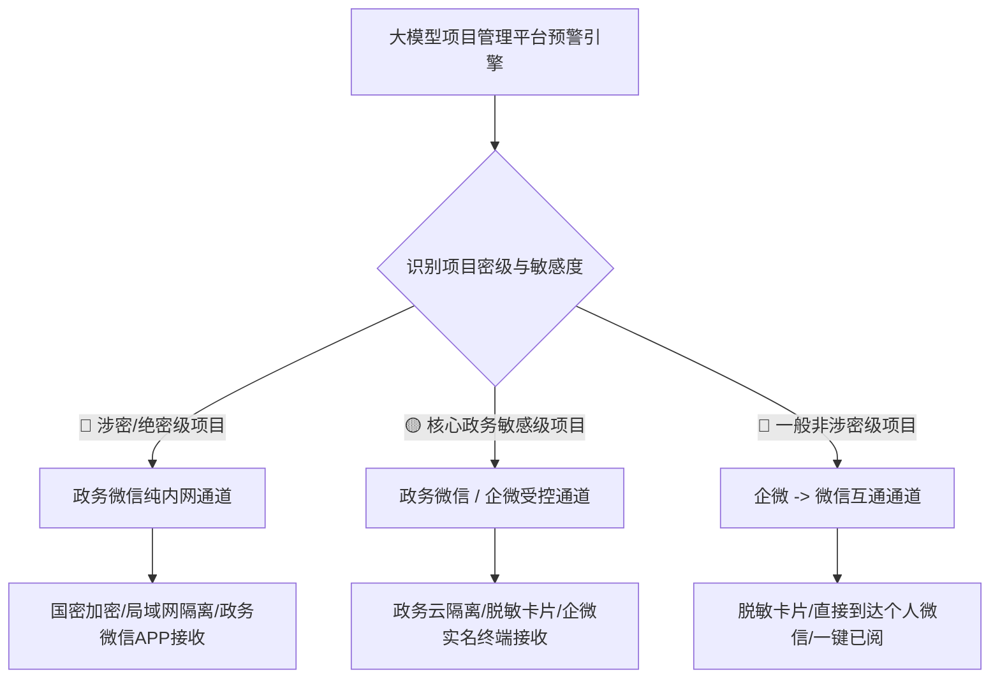

# 政府信息中心大模型智能信息化项目管理系统 - 微信推送与分级加密方案

根据 [需求.txt](file:///root/www/ProjectManager/docs/%E9%9C%80%E6%B1%82.txt) 系统设计说明及政务信息安全合规要求，本系统采用 **“分级分类加密 + 企业微信与政务微信双轨混合推送”** 的架构体系。既满足涉密/敏感项目的保密审查要求，又保证日常非涉密项目预警直接到达个人微信的高效体验。

---

## 一、 整体分级推送架构

系统根据项目的密级与风险敏感度，自动匹配对应的加密传输通道与微信接收终端：



---

## 二、 项目密级与微信推送路由标准

系统将信息化项目划分为三个密级等级，并执行差异化的加密与推送策略：

| 密级分类 | 适用项目类型 | 存储与加密要求 | 推送通道与载体 | 微信端接收表现与体验 |
| :--- | :--- | :--- | :--- | :--- |
| **🔴 涉密/绝密级（高）** | 涉密网络建设、核心数据中心机房、安全防御系统 | - **物理隔离**（不连互联网）<br>- 本地离线大模型<br>- 国密/AES-256 全文加密存储 | **政务微信（纯内网私有化版）** | **仅限政务微信内网接收**。严格禁止向公网个人微信投递，防止涉密信息外泄。 |
| **🟡 核心政务敏感级（中）** | 财政大额预算项目、局委办核心政务服务平台 | - 政务云隔离存储<br>- **文件 AES-GCM-256 加密**<br>- 全程操作留痕与水印审计 | **政务微信 / 企业微信（政务云受控网关）** | **推送完整分析卡片**。仅向已完成实名认证与设备绑定的企微/政务企微终端投递。 |
| **🔵 一般非涉密级（低）** | 硬件日常采购、网络升级改造、一般运维服务 | - 标准加密存储<br>- 关键敏感字段自动脱敏 | **企业微信 -> 微信互通网关** | **直接推送到个人微信**。无需下载企微 APP，方便领导与一线人员在日常微信中接收预警。 |

---

## 三、 微信推送场景 (Scenarios)

### 1. 固定关键节点到期提醒场景
- **资金付款节点**：预付款支付节点、进度款（1/2/3期）支付节点到期。
- **项目验收节点**：阶段性初验截止日、整体竣工验收截止日到期。
- **运维与质保节点**：项目质保期到期日。
- **过程管理与合规节点**：监理月报提交截止日、变更审批时限到期、审计资料提交时限到期。

### 2. 大模型研判风险专项预警场景
大模型比对多份项目资料（可研、合同、监理月报、测试报告、会议纪要等）分析出异常后触发：
- **进度滞后风险**：识别到“需求延期、供应商人员不足、硬件到货延迟”等滞后原因及预判天数。
- **质量隐患预警**：识别到重复出现的硬件故障、软件 Bug、施工不规范或未整改质量问题。
- **违规变更预警**：识别到需求/工期/金额变更未走审批流程、缺乏书面变更单的违规风险。
- **预算超支预警**：累计变更或支出超过概算红线。
- **付款材料缺失预警**：缺少发票、缺少阶段性验收单等无法付款的资料风险。

### 3. 日常工作与待办推送场景
- **待办事项清单**：AI 自动梳理生成项目待办列表并直接推送至微信。
- **文件上传触发**：日常拖拽上传新文件/会议纪要后，若 AI 识别到临近节点或新风险，实时主动推送。

---

## 四、 微信推送条件 (Conditions)

### 1. 三级时间节点倒计时触发条件
- 🔵 **提前 7 天（蓝色温馨提醒）**：距关键节点/截止日剩余 7 天，提醒负责人提前准备资料。
- 🟡 **节点当日（黄色紧急提醒）**：距关键节点/截止日剩余 0 天（当日到期），提醒当日必须完成付款/验收/资料提交。
- 🔴 **逾期超期（红色风险预警）**：节点已超过截止日期（剩余天数 < 0），AI 同步附带说明逾期影响（违约、无法按时验收、审计风险）。

### 2. AI 智能研判事件驱动条件
- **实时触发**：无需等到固定时间点，只要大模型从最新上传的文件（如监理周报、变更单、会议纪要）中识别出高风险、超预算、未审批变更或质量隐患，**立即主动触发推送**。

---

## 五、 系统加密与技术实施机制 (Mechanisms)

### 1. 混合推送路由算法 (`PushAlertRouting`)
在后端 [backend/security.go](file:///root/www/ProjectManager/backend/security.go) 中根据项目密级自动选择通道：

```go
// PushAlertRouting 根据项目密级与风险级别自动选择最佳微信推送通道
func PushAlertRouting(project *Project, alert *Alert) error {
    // 1. 涉密/高敏感项目：强制使用政务微信纯内网通道
    if project.SecurityLevel == "confidential" || project.IsSecret {
        return SendGovWeChatPrivateMessage(project, alert)
    }

    // 2. 中敏感项目（如严重红色风险预警）：向分管领导发送完整分析卡片
    if alert.Level == "red" {
        return SendEnterpriseWeChatFullCard(project, alert)
    }

    // 3. 一般非涉密项目（提前7天常规到期）：向个人微信发送脱敏卡片
    desensitizedSummary := DesensitizeText(alert.Summary)
    return SendWeChatPublicNotice(project, desensitizedSummary)
}
```

### 2. 敏感字段星号脱敏机制
非涉密通道向个人微信推送消息时，系统对敏感字段（如具体金额、内部保密文号等）执行自动掩码脱敏：
```text
【XX 信息化项目预警】
- 项目名称：XX 政务平台升级项目
- 风险类型：竣工验收即将到期（剩余 5 天）
- 金额节点：进度款支付 (已完成 *** 万元)
- AI 分析：根据监理月报，尚有 3 项功能未完成测试，存在验收延误风险
- 待办事项：上传阶段性测试报告、组织初验评审
- 系统直达链接：点击查看项目全部资料与整改建议
```

### 3. 免 APP 免公众号直接到达个人微信机制
- 配合企业微信【微信插件】，用户使用普通微信扫码关注后，消息直接呈现在**普通微信**聊天列表中。
- 无需专门申请微信公众号，无需强制下载安装企业微信 APP。

### 4. 消息已阅回执与 30 天历史留存机制
- **卡片交互**：微信卡片带有 **[点击已阅]** 按钮，负责人确认后后台自动更新记录；领导可查看谁未处理预警。
- **历史留存**：微信端自动留存近 30 天推送，无需频繁登录电脑端 Web 管理后台。
